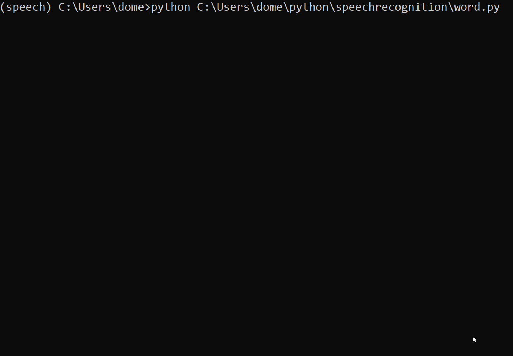

# play-the-radio
Speech recognition for playing any web radio (or technically doing anything on the web) in 12 lines of code using Python´s speech recognition package and selenium.

For a small tutorial see [my blog](https://geo.rocks/post/speechrecognition).

Prerequistites:
- Anaconda virtual environment (for clean installation of all required packages and to avoid Pythons´s dependency hell)
- speech_recognition package
- selenium package
- geckodriver (Firefox), chromedriver (Chrome) 

Feel free to adopt for other purposes:
- play youtube videos (i.e. from youtube, but take care of add blocking, see [stack overflow]( https://stackoverflow.com/questions/20832159/python-using-adblock-with-selenium-and-firefox-webdriver))
- play spotify (requires login every time)
- order pizza
... be creative!
  
  

